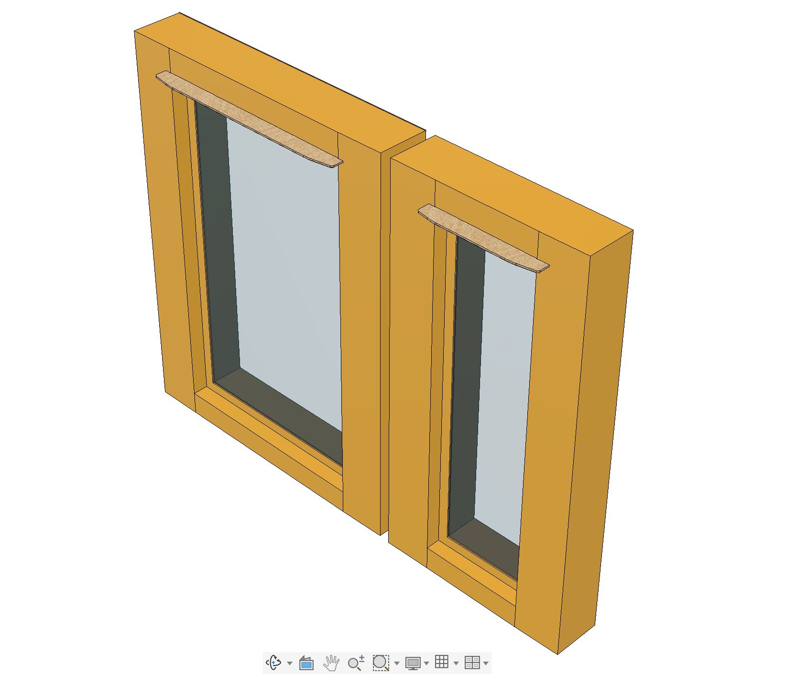
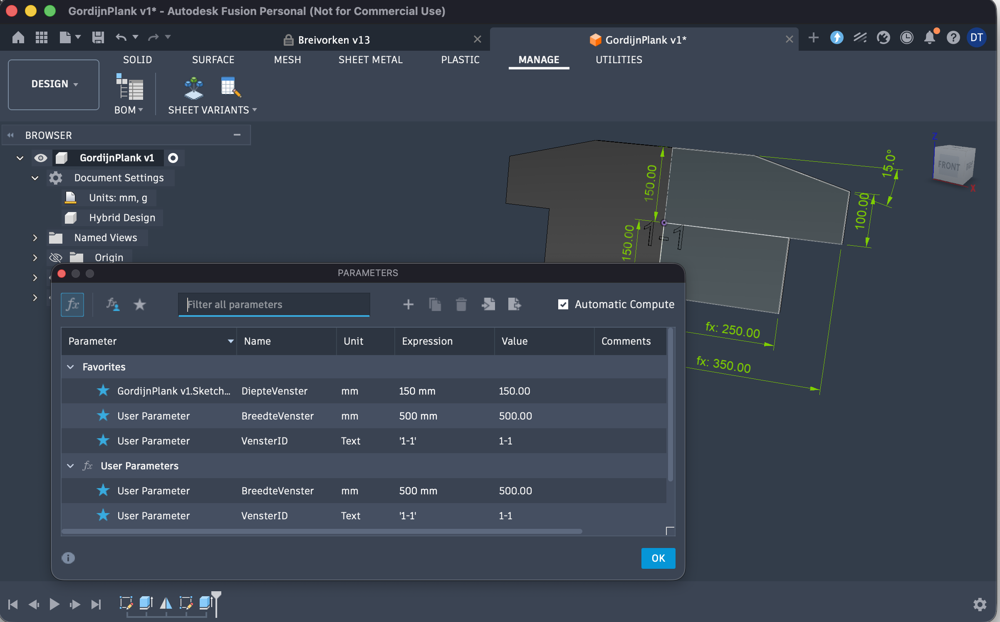
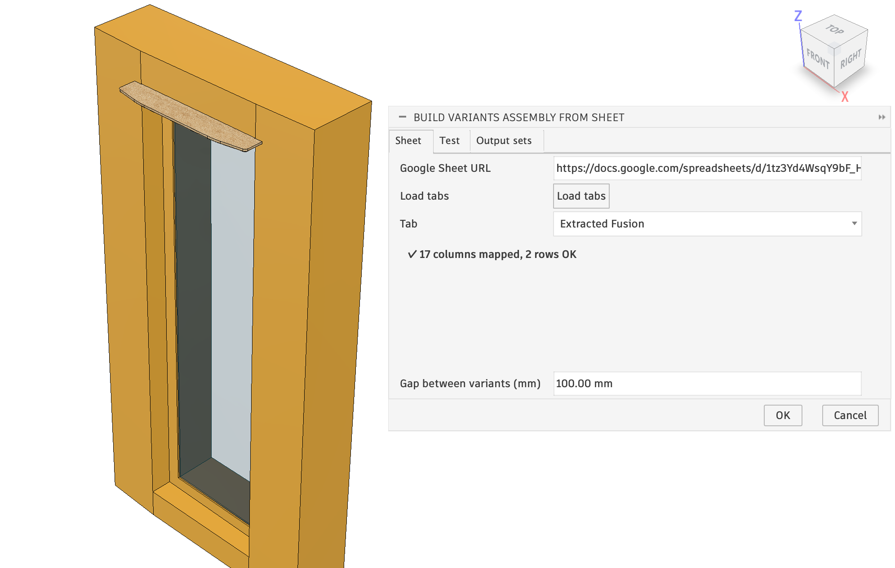
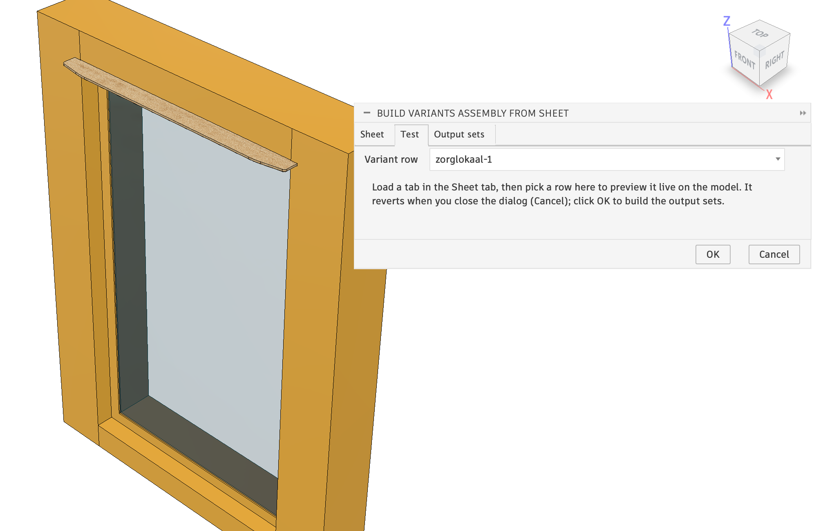
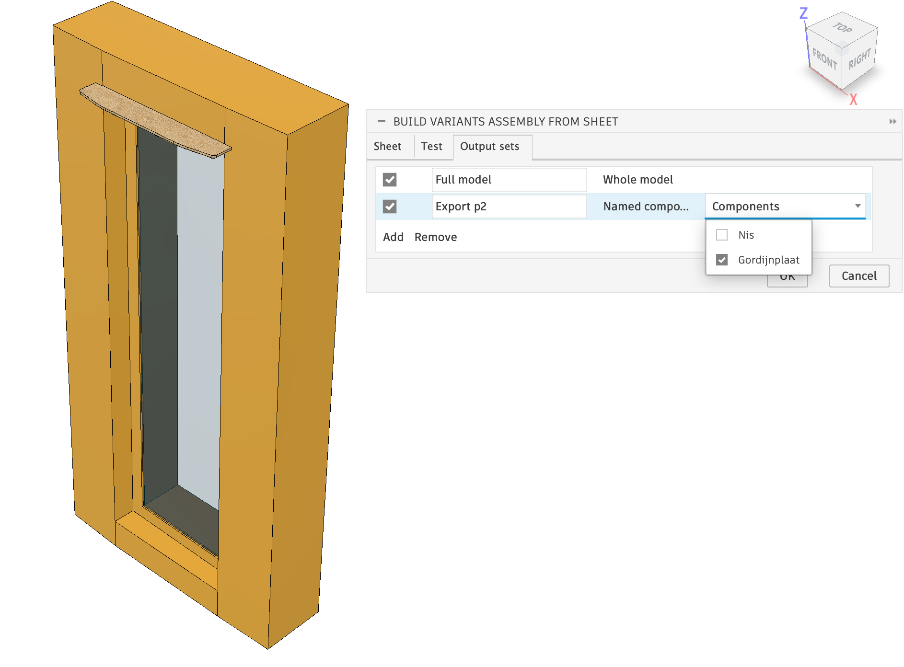
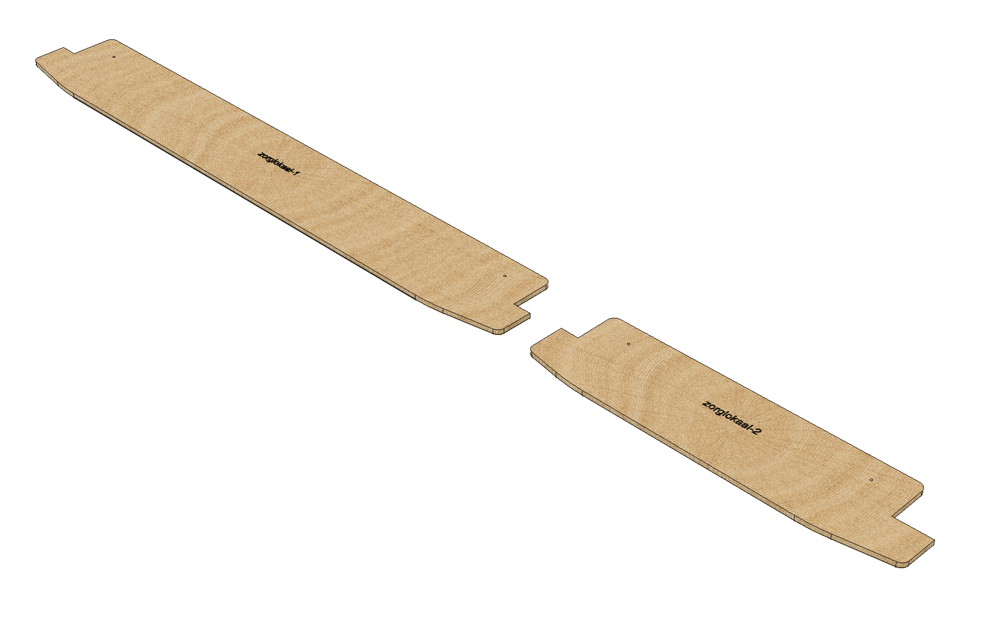

# Sheet to Fusion — production assembly builder


A [Autodesk Fusion](https://www.autodesk.com/products/fusion-360/) add-in that turns a
Google Sheet of parameter values into a production assembly. It reads every variant
row, applies the parameters to your parametric model, and builds each of your named
**export profiles** — the whole model, or just a chosen subset of components — into
its own new design, one component per variant.

It can also generate the sheet **template** straight from the model's favorite
parameters, so the column names always match.



## Features

- **Create Variant Sheet Template** — writes a CSV whose columns are the model's
  favorite (or all user) parameters, seeded with the current values as an example.
- **Build Variants Assembly from Sheet** — reads a Google Sheet, applies each row's
  parameters, and runs every enabled **export profile**, each producing its own new
  design with one component per variant.
- **Export profiles** — named, editable rows in the Build dialog. Each profile picks
  a selection rule: **Whole model** (every solid body, the classic behaviour) or
  **Named components** (only the ticked components from the source design). Profiles
  are saved to `settings.json` so they persist between runs.
- **Tab picker for multi-tab sheets** — if the linked sheet has more than one
  tab, **Load tabs** lists them so you can pick the one with your variants. The
  choice is pinned per sheet and remembered next time you open that link.
- **Sheet validation** — a **Check** report matches every column to a model
  parameter (or flags it), warns about parameters with no column, and flags bad
  cells (comma decimals, empty values). The **OK/Build** button is disabled
  until the errors are fixed.
- **Test tab** — pick one sheet row to preview it live on the open model so you
  can eyeball it; the model reverts when you close the dialog.
- **Materials & appearances** — built variants keep the source model's materials
  and body appearances, so each export looks like the original instead of flat grey.
- No Google Cloud project or API key: multi-tab sheets are fetched once as an
  XLSX workbook and parsed with the standard library (`zipfile`); single-tab
  and published-to-web links are still read as CSV.
- Geometry is copied in-memory (no SAT/STEP export), so it also works on the
  **Fusion Personal** licence, which restricts file exports.
- Variants are laid out left-to-right with a fixed gap between their bounding boxes,
  so differently-sized variants never overlap.
- Text parameters are handled automatically: the template writes them unquoted
  (`A-6`, not `'A-6'`) and the importer re-quotes them based on the model's
  parameter type — so a number used as engraving text stays text.
- The source model is restored to its original parameter values when finished.

## Requirements

- Autodesk Fusion (formerly Fusion 360).
- A parametric source model with named user/model parameters.
- A Google Sheet shared as **Anyone with the link** or **Published to web (CSV)**.

## Install

### Download the latest release (recommended)

1. Download **`SheetVariants-<version>.zip`** from the
   [latest release](https://github.com/DavidTruyens/Sheet-to-fusion-production/releases/latest)
   and unzip it — it contains just the `SheetVariants` add-in folder.
2. In Fusion: **Utilities → Scripts and Add-Ins → Add-Ins tab → green +**, browse to
   the unzipped `SheetVariants` folder, select it and click **Run**. A **Sheet
   Variants** panel appears on the **MANAGE** tab.

To have Fusion auto-list it, drop the `SheetVariants` folder into the add-ins
directory instead: `%appdata%\Autodesk\Autodesk Fusion 360\API\AddIns` on Windows,
or `~/Library/Application Support/Autodesk/Autodesk Fusion 360/API/AddIns` on macOS.

### From source

Prefer the code? Clone the repo and point Fusion at the `SheetVariants` folder the
same way:

```bash
git clone https://github.com/DavidTruyens/Sheet-to-fusion-production.git
```



## Sheet layout

One variant per row. Column A is the component name; every other column maps to a
parameter name in the model.

| Name       | length | width | height |
|------------|--------|-------|--------|
| Bracket_S  | 50 mm  | 20 mm | 10 mm  |
| Bracket_M  | 80 mm  | 30 mm | 15 mm  |
| Bracket_L  | 120 mm | 40 mm | 20 mm  |

- **Column A header must be `Name`.**
- Other headers must match parameter names exactly (case-sensitive). User parameters
  and named model parameters both work.
- Put **units** in the cells (`50 mm`, `30 deg`); the value is written into the
  parameter expression. Blank cells leave that parameter unchanged.

A ready-to-use sample is in [`examples/variants_example.csv`](examples/variants_example.csv).

## Workflow

1. In the Parameters dialog, **star** the parameters you want to drive.
2. Run **Create Variant Sheet Template**, choose Favorites or all user parameters,
   save the CSV.
3. In Google Sheets: **File → Import → Upload** the CSV; add one row per variant.
   Share the sheet ("Anyone with the link") or publish it to the web as CSV.
4. Open your source model and run **Build Variants Assembly from Sheet** — a
   3-tab dialog:
   - **Sheet tab** — paste the sheet link, **Load tabs**, pick the tab with
     your variants, and clear anything the **Check** report flags.
   - **Test tab** *(optional)* — pick a variant row to preview it live on the
     model; it reverts when you close the dialog.
   - **Output sets tab** — check your export profiles (see below).
   Click **OK** to build.

For each *enabled* profile, a new untitled design opens named after that profile,
with one named component per variant, laid out left-to-right with the gap you
chose between each one's bounding box.

## Picking a sheet tab

If the linked Google Sheet has more than one tab, the **Sheet tab**'s **Load
tabs** button (above the **Tab** picker) fetches the sheet once as an XLSX
workbook and lists every tab in it; pick the one with your variant rows. That
choice is **pinned per sheet** (keyed by the sheet's id) and pre-selected next
time you open the dialog with the same link. Links with no spreadsheet id — a
published-to-web or direct-CSV link — have nothing to list; the Tab picker
shows a single placeholder and the sheet is read as one CSV table instead.

Below the Tab picker, a **Check** report validates the chosen tab against the
model before you build:

- each column is matched to a model parameter, or flagged if it matches none;
- model parameters with no matching column are listed as a warning (they keep
  their current value);
- cells that look wrong are flagged — a comma decimal like `18,2` is an error
  (use a dot and a unit instead, e.g. `18.2 mm`), and empty cells are a warning.

While the report has errors, the dialog's **OK/Build** button is disabled; fix
the sheet (or pick a different tab) until it's clean.



## Test tab (live preview)

After loading a tab, switch to the **Test tab** and choose a row from the
**Variant row** dropdown: that row's values are applied to the open model as a
**live preview** so you can inspect it. The model automatically **reverts to its
original values when you close the dialog** (Cancel), so the preview never leaves
the model modified — or click **OK** to build the output sets.



## Remembering the sheet per design

The Google Sheet URL is stored **on the design itself**, so each design
pre-fills its own sheet link the next time you open the dialog with that design
active. A design that has never been linked starts with an empty URL field. The
link is remembered as soon as **Load tabs** reads the sheet (and again on build).

## Export profiles

The Build dialog's **Output sets** tab has an **Export profiles** table — one
row per output design. Each row has:

- **Enabled** — untick to skip a profile without deleting it.
- **Name** — used as the new design's name.
- **Rule** — **Whole model** (every solid body, root plus occurrences) or
  **Named components** — pick which components go into this export from a
  checklist of the source design's current components.
- **Components** — only shown/used for Named components; the picker lists the
  components in the active design when the dialog opened.

Use **Add**/**Remove** to add or delete profile rows. Profiles are saved to
`settings.json` alongside the sheet link and spacing, so they're remembered next
time you open the dialog.



A **Named components** profile exports only the chosen parts for each variant —
here, just the curtain board — so you can produce a focused assembly (e.g. for
cutting or nesting) alongside the full-model output:



If a Named-components profile references a component that no longer exists in
the model (renamed or deleted), that component is **warned about, not fatal**:
the run continues, the missing name is listed in that profile's line of the
summary, and the rest of the profile still builds from whatever components
were found. A profile is only skipped entirely if none of its components (or,
for Whole model, no solid bodies at all) are found.

## How the Google connection works

Fusion's bundled Python can't easily install the Google client libraries, so the
add-in reads the sheet using only the standard library — still no Google API key
or extra packages. A sheet with tabs to pick from is fetched **once** as an XLSX
workbook (`export?format=xlsx`) and parsed with `zipfile`; switching tabs or
previewing a row in the Test tab reuses that same download. A single-tab link (no
tabs to list) or a published-to-web link still uses the original CSV path: it's
converted to (or already is) an `export?format=csv` link and parsed with `csv`.
Nothing is written back to the sheet either way.

## Limitations

- Variants are copied as static geometry — no parametric history. That's intended
  for a clean production assembly.
- Components are placed (offset along X) but not jointed; add constraints as needed.
- The network fetch briefly blocks the Fusion UI while the sheet downloads.

## Roadmap

Planned / ideas (also tracked in [`CHANGELOG.md`](CHANGELOG.md)):

- **Sheet metal flat patterns** — build or export the flat pattern of sheet-metal
  components (e.g. as a dedicated output set) alongside the solid variants.
- **Filter by thickness** — filter which variants or components are built/exported
  by their material thickness.

## License

MIT — see [LICENSE](LICENSE).
