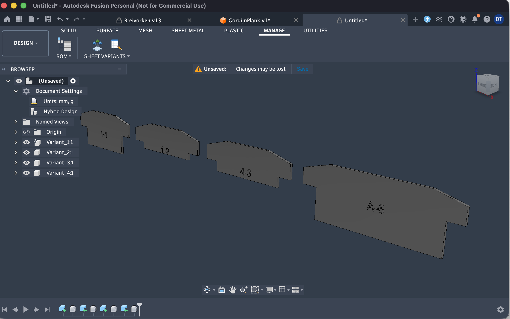

# Sheet to Fusion — production assembly builder


A [Autodesk Fusion](https://www.autodesk.com/products/fusion-360/) add-in that turns a
Google Sheet of parameter values into a production assembly. It reads every variant
row, applies the parameters to your parametric model, and drops a copy of each
variant into a new design as a separate component.

It can also generate the sheet **template** straight from the model's favorite
parameters, so the column names always match.



## Features

- **Create Variant Sheet Template** — writes a CSV whose columns are the model's
  favorite (or all user) parameters, seeded with the current values as an example.
- **Build Variants Assembly from Sheet** — reads a Google Sheet, applies each row's
  parameters, and assembles a copy of every variant into a new design.
- No Google Cloud project or API key: the sheet is read as CSV over HTTP.
- Geometry is copied in-memory (no SAT/STEP export), so it also works on the
  **Fusion Personal** licence, which restricts file exports.
- Variants are laid out left-to-right with a fixed gap between their bounding boxes,
  so differently-sized variants never overlap.
- Text parameters are handled automatically: the template writes them unquoted
  (`A-6`, not `'A-6'`) and the importer re-quotes them based on the model's
  parameter type — so a number used as engraving text stays text.
- The source model is restored to its original parameter values when finished.

## Requirements

- Autodesk Fusion (formerly Fusion 360).
- A parametric source model with named user/model parameters.
- A Google Sheet shared as **Anyone with the link** or **Published to web (CSV)**.

## Install

Clone or download this repo, then point Fusion at the add-in folder:

```bash
git clone https://github.com/DavidTruyens/Sheet-to-fusion-production.git
```

In Fusion: **Utilities → Scripts and Add-Ins → Add-Ins tab → green +**, browse to the
`SheetVariants` folder inside this repo, then select it and click **Run**. A new
**Sheet Variants** panel with two buttons appears on the **MANAGE** tab.

(To have Fusion auto-list it, the `SheetVariants` folder can also be copied into the
Fusion add-ins directory: `%appdata%\Autodesk\Autodesk Fusion 360\API\AddIns` on
Windows, or `~/Library/Application Support/Autodesk/Autodesk Fusion 360/API/AddIns`
on macOS.)


## Sheet layout

One variant per row. Column A is the component name; every other column maps to a
parameter name in the model.

| Name       | length | width | height |
|------------|--------|-------|--------|
| Bracket_S  | 50 mm  | 20 mm | 10 mm  |
| Bracket_M  | 80 mm  | 30 mm | 15 mm  |
| Bracket_L  | 120 mm | 40 mm | 20 mm  |

- **Column A header must be `Name`.**
- Other headers must match parameter names exactly (case-sensitive). User parameters
  and named model parameters both work.
- Put **units** in the cells (`50 mm`, `30 deg`); the value is written into the
  parameter expression. Blank cells leave that parameter unchanged.

A ready-to-use sample is in [`examples/variants_example.csv`](examples/variants_example.csv).

## Workflow

1. In the Parameters dialog, **star** the parameters you want to drive.
2. Run **Create Variant Sheet Template**, choose Favorites or all user parameters,
   save the CSV.
3. In Google Sheets: **File → Import → Upload** the CSV; add one row per variant.
   Share the sheet ("Anyone with the link") or publish it to the web as CSV.
4. Open your source model, run **Build Variants Assembly from Sheet**, paste the
   sheet link, set the gap between variants, and run.

A new untitled design opens with one named component per variant, laid out
left-to-right with the gap you chose between each one's bounding box.

## How the Google connection works

Fusion's bundled Python can't easily install the Google client libraries, so the
add-in fetches the sheet as CSV using only the standard library (`urllib` + `csv`).
A normal share/edit link is converted to the `export?format=csv` link automatically;
a published-to-web CSV link is used as-is. Nothing is written back to the sheet.

## Limitations

- Variants are copied as static geometry — no parametric history. That's intended
  for a clean production assembly.
- Components are placed (offset along X) but not jointed; add constraints as needed.
- The network fetch briefly blocks the Fusion UI while the sheet downloads.

## License

MIT — see [LICENSE](LICENSE).
